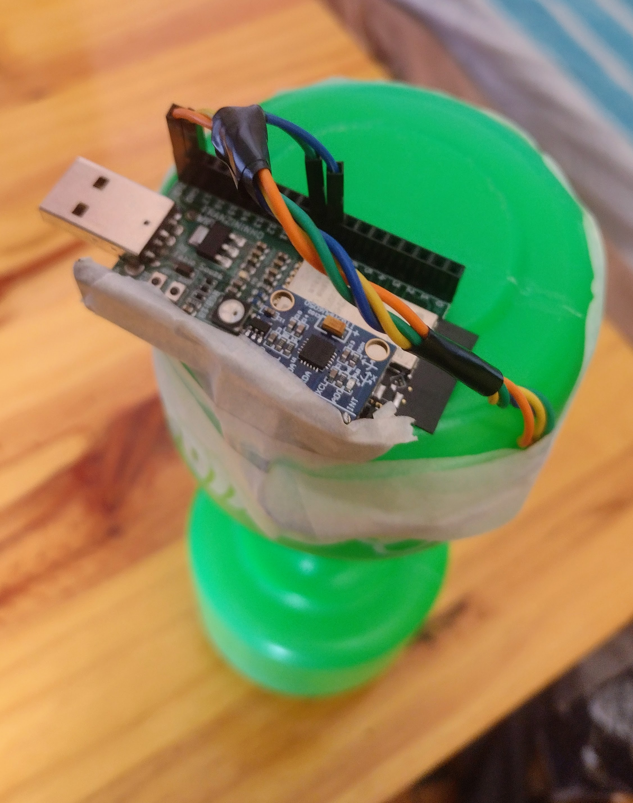

# PersonalTrainer-FranzininhoWiFi
Um haltere com Inteligência Artificial na borda embarcada em uma placa de desenvolvimento Franzininho WiFi

  

# Conteúdos
Nesse repositório podem ser encontrados os arquivos utilizados para aquisição de dados, inferência e um artigo feito para a placa Arduino Nano 33 BLE Sense.
